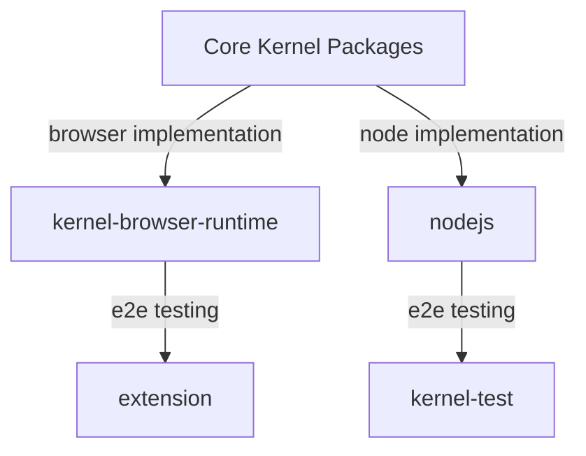

# Platform-Specific Development Guide

This document describes the architecture and development patterns for implementing platform-specific features in the OCAP Kernel ecosystem.

## Overview

The OCAP Kernel is designed to operate across multiple platforms while maintaining a consistent core API. Currently, the kernel targets two primary platforms:

- **Node.js** - Server-side JavaScript runtime
- **Browser** - Client-side web environment

## Architecture

The kernel follows a layered architecture where core packages contain both abstract type declarations and their corresponding platform-specific implementations. The platform-specific runtime packages serve as orchestrators that import the appropriate implementations from core packages via specialized export paths, providing the correct environment-specific functionality to the kernel.

### Package Structure

The core kernel packages export platform-specific implementations through dedicated modules:

- **Platform-obvious exports**: Modules like [`kernel-store/sqlite/nodejs`](../packages/kernel-store/src/sqlite/nodejs.ts) clearly target Node.js environments
- **Platform-implicit exports**: Modules like [`kernel-store/sqlite/wasm`](../packages/kernel-store/src/sqlite/wasm.ts) target browser environments through WebAssembly

The platform-specific runtime packages ([`kernel-browser-runtime`](../packages/kernel-browser-runtime/) and [`nodejs`](../packages/nodejs/)) are responsible for:
- Importing the appropriate platform-specific implementations
- Providing these implementations to the `Kernel` constructor
- Handling platform-specific initialization and configuration

### Testing Strategy

Each platform implementation includes comprehensive end-to-end testing:
- **Browser platform**: Tested through the [`extension`](../packages/extension/) package
- **Node.js platform**: Tested through the [`kernel-test`](../packages/kernel-test/) package

## Development Guidelines

When developing features that require platform-specific implementations, follow this structured approach:

### 1. Package Creation

Create a new package for the feature (existing packages may suffice in some cases, but this is uncommon for cross-platform features). See [`packages/create-package/README.md`](../packages/create-package/README.md) for guidance on package creation.

### 2. Platform-Agnostic Implementation

- Implement shared types and abstractions in `my-package/src/`
- Export platform-agnostic features through `index.ts` following standard conventions
- Define clear interfaces that platform-specific implementations must satisfy

### 3. Platform-Specific Implementation

Choose an appropriate directory structure based on your feature's complexity:

- **Simple platform variants**: `my-package/src/<platform>/` (e.g., `my-package/src/nodejs/`)
- **Complex feature-platform combinations**: `my-package/src/<feature>/<platform>` (e.g., `my-package/src/storage/nodejs`)

### 4. Package Configuration

Update `package.json` to export platform-specific features:
- Simple structure: `@ocap/my-package/<platform>`
- Complex structure: `@ocap/my-package/<feature>/<platform>`

Ensure the export paths match your implementation directory structure and follow the project's naming conventions.

### 5. Platform Integration

Integrate your feature into the appropriate platform-specific runtime package:

- **Node.js features**: Import and utilize your feature in the [`nodejs`](../packages/nodejs/) package, typically in files such as:
  - [`vat-worker.ts`](../packages/nodejs/src/vat/vat-worker.ts) for vat-related functionality
  - [`make-kernel.ts`](../packages/nodejs/src/kernel/make-kernel.ts) for kernel construction features
- **Browser features**: Import and utilize your feature in the [`kernel-browser-runtime`](../packages/kernel-browser-runtime/) package, typically in files such as:
  - [`kernel-worker.ts`](../packages/kernel-browser-runtime/src/kernel-worker/kernel-worker.ts) for kernel worker functionality
  - [`iframe.ts`](../packages/kernel-browser-runtime/src/vat/iframe.ts) for vat iframe functionality

### 6. End-to-End Testing

Implement comprehensive tests for your platform-specific feature:

- **Node.js features**: Add tests to the [`kernel-test`](../packages/kernel-test/) package to verify functionality in the Node.js environment
- **Browser features**: Add tests to the [`extension`](../packages/extension/) package to verify functionality in the browser environment

Ensure your tests cover both the platform-agnostic interface and the platform-specific behavior.
