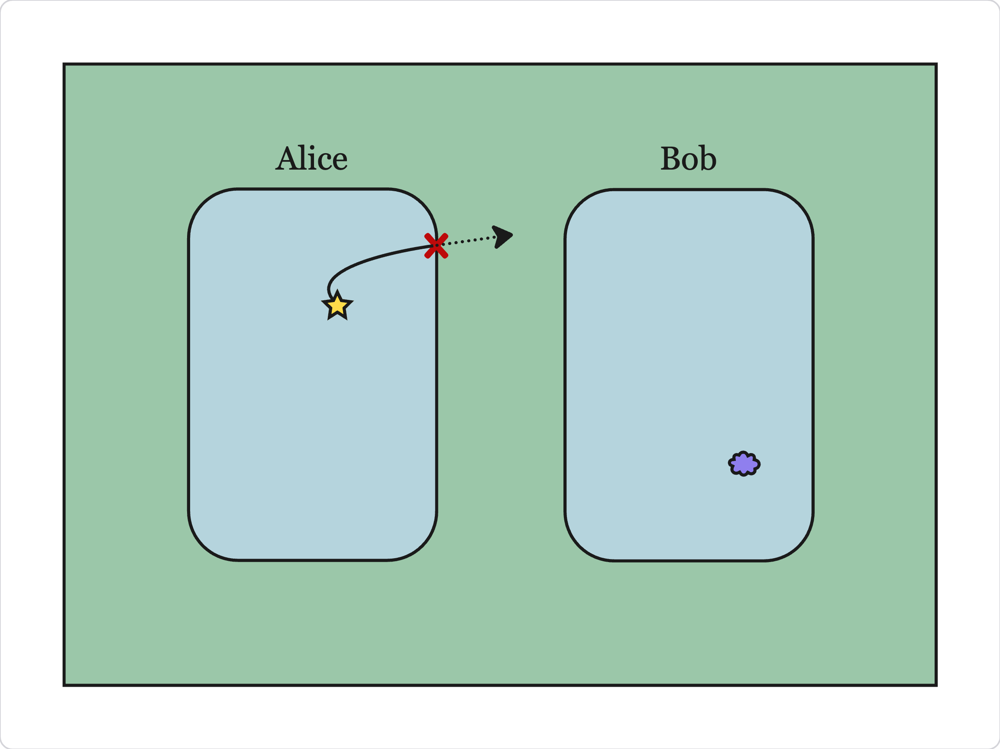
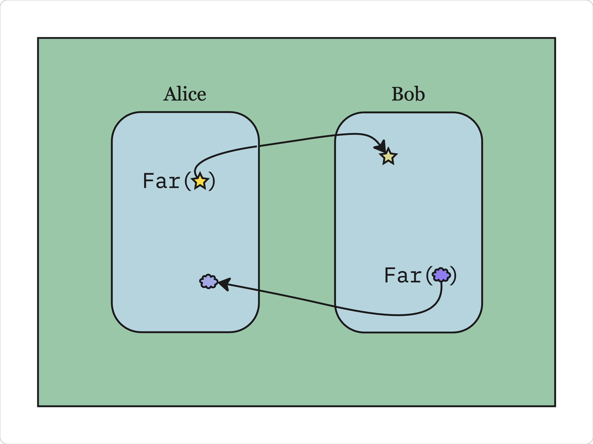

By design, regular javascript objects cannot escape the vat they are created in.

Only explicitly _remotable_ objects—those created with endo's `Far` function—can cross the vat boundary.

The vat that created a given remotable is called that remotable's _home vat_.

For example, the root object a vat is a remotable. Each vat is the home vat of its root object.

A remotable has only methods; it does not have state or values of its own, though its methods may reference mutable variables which live in its home vat.

To create a remotable object, use `Far`. To call a remotable method, use `E`.

The result of a remotable method call is a promise that must be awaited before use.
